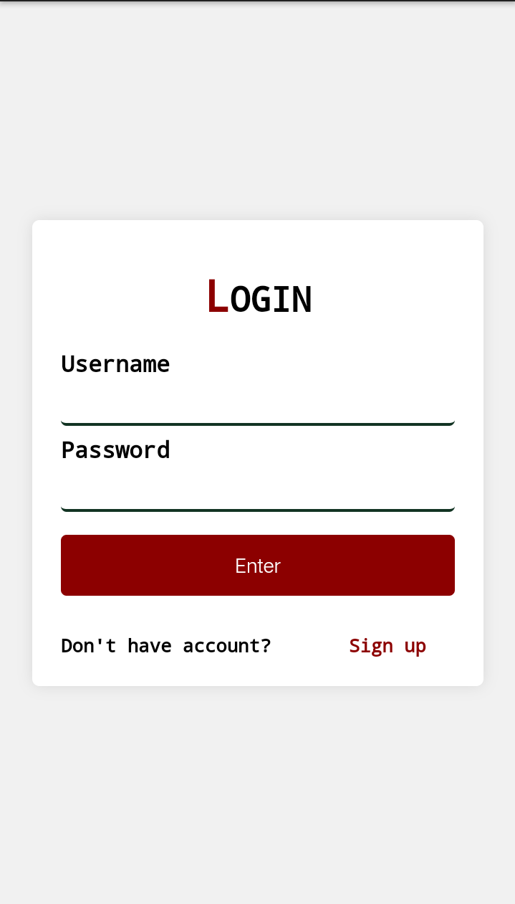
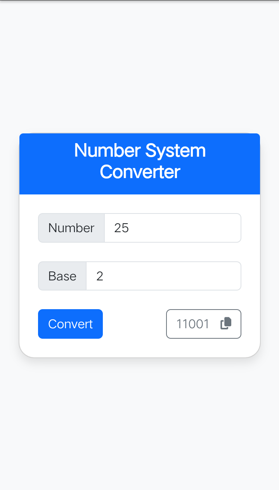

# Code by MFM
All my HTML/CSS/JS Code on CodePen. I will update this Repo almost on next weekend

## Code Details
### Login-Form

A simple, responsive login page with a clean design, featuring a username and password form, styled with CSS.

### Number System Converter

Simple Number System Converter for converting decimal numbers to binary, octal, and hexadecimal bases. Convert and copy results with ease.

## Credits
Created by [@MFM](https://github.com/MFM-347)

## LICENSE

